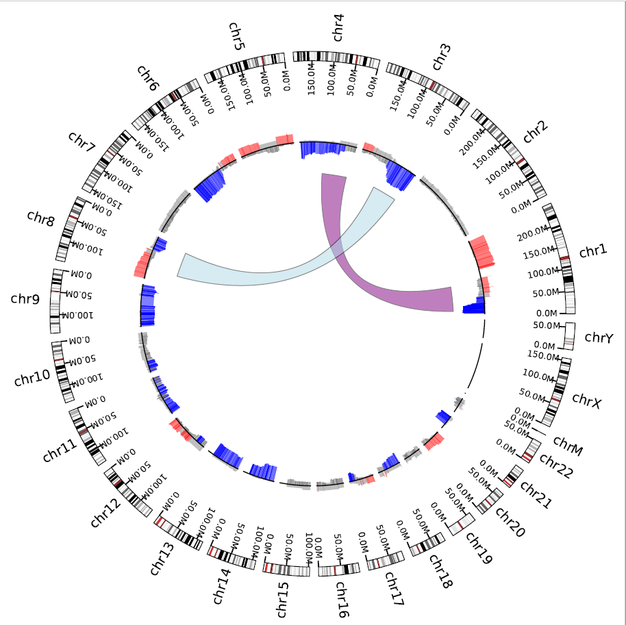

### Python Modules for Circos Plot


1. Prerequisition

- Python 2.7 packages (automatically installed)
  - numpy >= 1.13.1
  - pandas >= 0.15.2
  - matplotlib =2.0.2

- Python 3.4+ packages(automatically installed)
  - numpy >= 1.13.1
  - pandas >= 0.15.2
  - matplotlib >= 2.0.2

2. Installation
   - intall dev branch

    ```
    git clone https://github.com/KimBioInfoStudio/PyCircos.git
    cd Pycircos
    python setup.py install [--user]
    ```
    - install release branch
    ```
    pip install -r requirements.txt
    pip install pycircos
    ```
    
3. Examples


```
cd demo
python run_circos.py run
display Circos.pdf
```
4. Demo Results 




