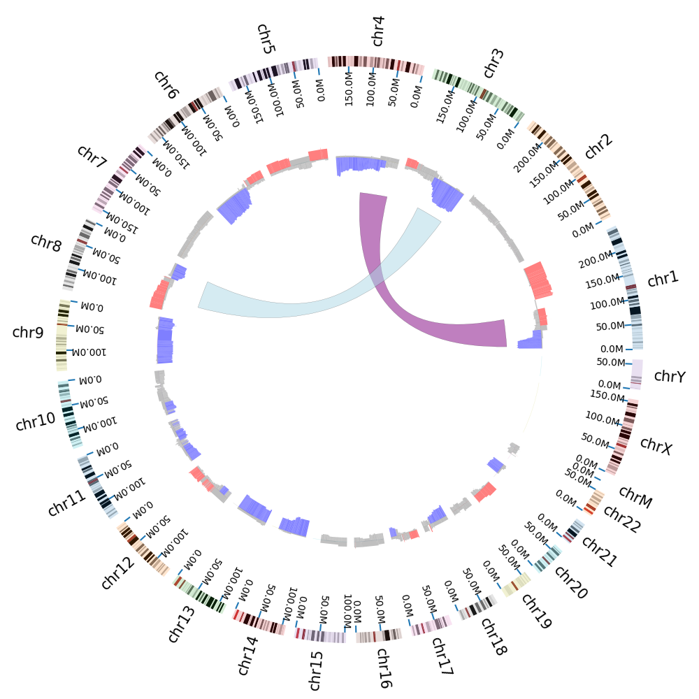

# Python Modules for Circos Plot

[](https://travis-ci.com/KimBioInfoStudio/PyCircos)


## 1. Pre Installation

> As official, Pyhton2 will end life form 2020-1-1, So we develop a new version support Python3.5+, We deeply recommand all users using the python version 3.5+, Thx!

### Python 3.5+ packages(automatically installed)

1. numpy
2. pandas
3. matplotlib


## 2. Installation
### intall dev branch

1. install from source code 

```
git clone https://github.com/KimBioInfoStudio/PyCircos.git
cd PyCircos
pip install -r requirements.txt
python3 setup.py install [--user]
```

2. or install form source code with using 'make'

```
git clone https://github.com/KimBioInfoStudio/PyCircos.git
cd PyCircos
make install 
```

3. install release branch

```
pip install pycircos
```
    
## 3. Examples
### command

```
cd ./test/
python3 test.py
open ./demo.png
``` 
### results
 



